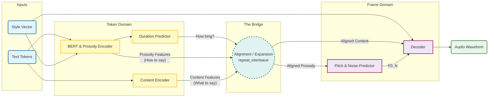
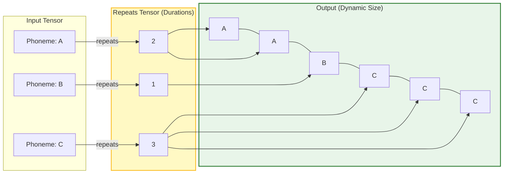
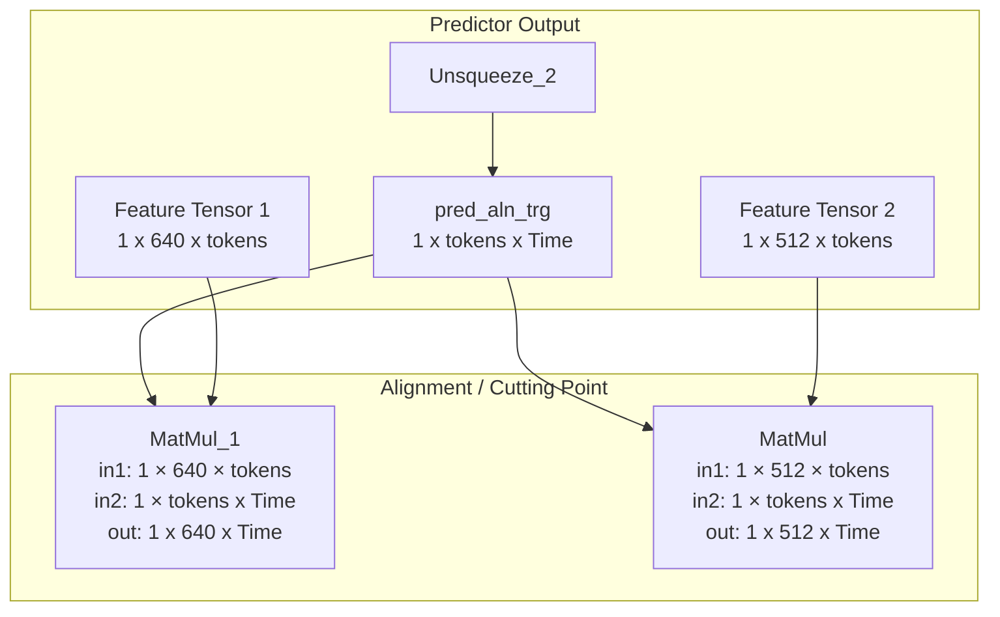

# Decomposition design in NPUW for kokoro-82m

## Goal

- Support kokoro-82m inside NPU plugin with static shape input (fixed number of tokens).
- Achieve reasonable performance compared to CPU & GPU solutions.

## Problem statement

The NPU Plugin lacks support for dynamic shapes in the kokoro-82m scenario. There are currently two approaches implemented and used for dynamic models:

1. Upper bound dynamism - which is not applicable for the kokoro scenario because the upper bound size (and memory allocation) for the worst-case scenario is several times larger than the real data. See ["Bounded Dynamism"](#b-bounded-dynamism) section.
2. NPUW decomposition - currently focused on LLM models (decomposition into prefill and kvcache) and the Whisper model.

## Context

### Kokoro-82m model

Kokoro-82m model is composition of different models (bert, for example), but in general can be separated into two parts by using layer which introduce dynamism to this model - torch.repeat_interleave operation, which performs a "scatter/gather" or "expansion" based on the *values* inside `pred_dur`.

- `Text Encoder` $\to$ `Duration Predictor` $\to$ **[The Bridge]** $\to$ `Decoder`.
- Input of the model can be converted to static, but bridge introduce global data-dependent dynamism.



### Repeat interleave layer 

Input of repeat interleave (pred_dur) is a vector of integers indicating how many time frames each input token lasts. 



- tokens:     [CLS], today, is, rainy, ., [SEP] (6 tokens, can be static)
- pred_dur: [0, 2, 1, 3, 1, 0] (N = 6)
- result [1, 1, 2, 3, 3, 3, 4] - dynamic
  - upper bound = number of tokens * max phoneme length  (real cases 0-50 frames)
  - upper bound size = 6 * 10 = 60, real size = 7

When it's represented as single operation inside Pytorch, during import of OpenVINO it's transformed to sequence of different operation like `Range`, `Tile` to reproduce the logic using available inside OpenVINO operations.

#### Repeat interleave + alignment

Alignment is conversion from token domain to time domain.

Operation: Y=F×A

F - Feature matrix \[Features, Tokens\] for two tokens (A & B)

$$
F=\begin{bmatrix}A_{1}&B_{1} \\\ A_{2}&B_{2} \\\ A_{3}&B_{3}\end{bmatrix}
$$

A - Alignment Matrix \[Tokens, Time\] (Sparse, mostly zeros)

$$
A=\begin{bmatrix} 1&1&0 \\\ 0&0&1  \end{bmatrix}
$$

Y - features in time domain \[Features, Time\]

$$
Y= \begin{bmatrix} A_{1}&A_{1}&B_{1} \\\ A_{2}&A_{2}&B_{2} \\\ A_{3}&A_{3}&B_{3} \end{bmatrix}
$$

## Design

- **Concept**:
  Use the location where dynamism is introduced as the cutting point (`repeat_interleave` layer) to split the original model into two models. The first `Predictor` (Model A) will be responsible only for duration prediction and generating two feature matrices (Prosody Features and Content Features). For the second `Decoder` (Model B), replace the dynamic dimension introduced inside `repeat_interleave` with a fixed-size block (small size, 100-200 timeframes to avoid long compilation), thereby converting the model into a static version. To connect both models, generate multiple fixed-size aligned feature matrices (see [Repeat interleave alignment](#repeat-interleave--alignment)) inside the loop (create fixed-size matrix -> run model b -> gather result). The loop will be executed on host side (CPU).

- **Roadblocks**:
  1. **Context Continuity**: Audio generation is sensitive. Splitting the graph often creates "clicks" or "fading" at the boundaries. We need complex overlap handling (Host complexity).
  2. **Compilation Overhead**: The second part (Decoder) is massive (STFT/ISTFT) and takes a long time to compile.
- **Limitations**:
  1. **Static input**: Static input required in order to do decomposition into two static parts.
  2. **Duplication for other inputs**: Since model contain also style (`ref_s`) and speed inputs, there will be some duplication between two models. These inputs will be used for both model.

### Decomposition

#### Predictor

**How to cut**: Original model already contain predictor as one of the model outputs. All we need to do to create copy of original model with only `pred_dur` (predicted duration) output.

#### Decoder

**How to cut**: Inside the kokoro-82m model, there is a large subgraph responsible for the repeat interleave layer and creating the alignment matrix (see [Repeat interleave layer](#repeat-interleave-layer)). Since the responsibility of creating the aligned matrix in this decomposed pipeline will be on the host side, we need to create a model that accepts both aligned matrices as input. The diagram below represents the location in the original model where this alignment is performed. To create the static decoder model, we have to find the location of both MatMul operations, use their outputs as inputs for the new model, and replace the dynamic `Time` dimension with a fixed block size.



### Manual alignment + loop execution

The host application will implement the alignment logic (equivalent to `torch.repeat_interleave` followed by matrix multiplication)
First, create `idx` array which can be used in Gather operation to extract features vectors from matrix.  
```
pred_dur        idx
[1, 2, 3, 1] -> [0, 1, 1, 2, 2, 2, 3]
```
On this stage we moved from token to time domain.  

Then, in loop, using fixed block size (limiting maximum time frames processed at once), we need to create aligned in time feature matrix
```
Features (L=3)      Indices (idx)        Destination (block=5)  
[ A | B | C ]   <-- [0, 0, 1, 2, 2] --> [ A | A | B | C | C ]
```
Run model b using it and process audio output (add result / handle padding).

## Alternatives considered

### A. Static Compilation

- **Status**: Impossible.
- **Reason**: We cannot pre-calculate memory offsets or execution schedules because the tensor sizes are literally unknown.

### B. Bounded Dynamism

- **Concept**: Set a maximum limit and pad everything.
- **Problem**: "Shape Explosion".
  - To be safe, Upper Bound = `Input_Length` $\times$ `Max_Possible_Duration_Per_Token`.
  - *Example*: 500 tokens $\times$ 50 frames/token = **25,000 frames** allocated.
  - *Reality*: Average duration is ~5 frames. Actual needed = **2,500 frames**.
  - **Result**: 10x memory waste and massive compute waste processing zeros.
- **Compiler Issue**: Propagating these loose bounds through `Range` and `Tile` ops is complex and results in inefficient kernels.
