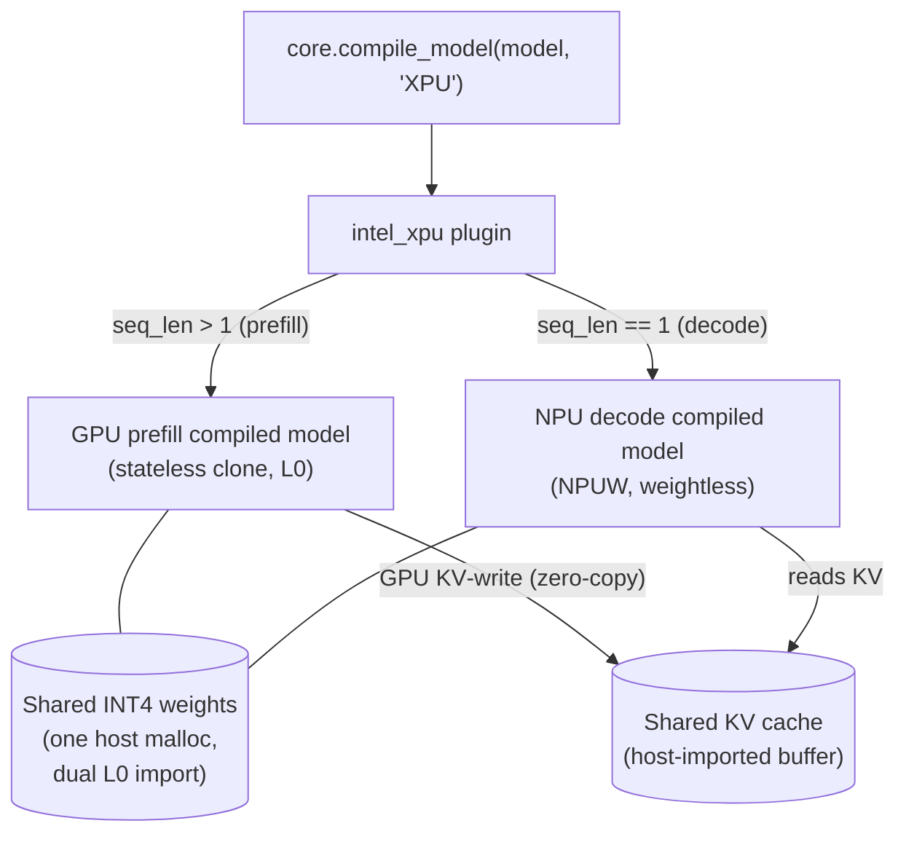

# XPU Plugin (GPU‑prefill + NPU‑decode hybrid)

## Introduction

The `intel_xpu` plugin is an OpenVINO **meta‑plugin** that fuses the Intel **GPU** and **NPU** into a single
`core.compile_model(model, "XPU")` and runs an LLM as:

- **GPU prefill** for the prompt (sequence length > 1), then
- **NPU decode** for autoregressive generation (sequence length == 1),

while **both engines read one physical copy** of the INT4 weights and **share the KV cache zero‑copy** — no
per‑device weight duplication and no host round‑trip of the KV cache between phases.

Prefill is compute‑bound (the GPU is faster) and decode is memory‑bound (the NPU is more power‑efficient).
Running each phase on the better engine — from a single model load and a single weight buffer — gives
NPU‑class decode efficiency together with GPU‑class prefill latency.

**Target platform:** Lunar Lake / Panther Lake (Core Ultra, "AI Boost" NPU + iGPU, unified memory), with the
GPU built on the **Level‑Zero backend** (`GPU_RT_TYPE=L0`). L0 is required — the one‑copy buffer sharing relies on
importing a single host allocation into both engines' Level‑Zero contexts.

## High level design



Per‑conversation flow: the GPU runs prefill, **writes the KV cache directly into the shared buffer in the NPU's
exact static format** (Convert→Transpose→ScatterUpdate, bound zero‑copy), and emits the last‑token logits; the
reused NPU request then decodes token‑by‑token, reading the same weights and KV cache. See the architecture
report for the full mechanism.

Key mechanisms (all detailed in [doc/ARCHITECTURE.md](doc/ARCHITECTURE.md)):

| Mechanism | Summary | Report § |
|---|---|---|
| One‑copy weights | Page‑aligned host malloc imported into both the GPU‑L0 and NPU‑L0 contexts (same pointer); native INT4 end‑to‑end (no f16 expansion). | §1, §2 |
| GPU prefill | Stateless clone (`StatefulToStateless`) of the model; INT8×INT4 FCs on oneDNN/XMX. | §4, §6 |
| GPU KV‑write | The GPU produces the NPU's static KV slot itself and writes it zero‑copy into the shared buffer (replaces a CPU cast/transpose/scatter bridge). | §3.3 |
| Last‑token logits slice | Prefill emits only `logits[-1]` (`[1,1,vocab]`), shrinking the LM‑head matmul and dropping a ~622 MB output. | §7.1.2 |
| NPU‑request reuse | The NPU generate request is created once and reused; each prefill just signals the prompt length. | §7.1 |
| NPU decode | NPUW weightless blob; KV cache adopted from the shared buffer without re‑running prefill. | §5 |

## Architecture report

The complete design — buffer‑sharing mechanism, INT4 layout, KV‑cache handoff, compile pipeline, memory flow,
performance analysis, and the one‑physical‑copy proof — is in:

➡ **[doc/ARCHITECTURE.md](doc/ARCHITECTURE.md)**

## Performance

Qwen3‑4B (INT4 sym, per‑channel), 1024‑token prompt, on an LNL Core Ultra. Stock rows are OpenVINO GenAI
(`llm_bench`); the hybrid row is the `intel_xpu` path (`doc/bench_npuw_vs_xpu.py`). See report §7.1.

| Configuration | Time‑to‑first‑token | Decode (2nd‑token) |
|---|---|---|
| Stock GPU (PagedAttention) | 163 ms | 23.9 ms/tok |
| Stock NPU (NPUW) | 710 ms | 38.8 ms/tok |
| **XPU hybrid** (GPU prefill → NPU decode) | **~230 ms** | **~36 ms/tok** |

- **Decode** matches standalone NPUW (≈ no shared‑buffer penalty) — power‑efficient NPU decode.
- **First‑token** went 1333 ms (CPU bridge) → ~700 (GPU KV‑write) → ~420 (NPU‑request reuse) → **~230 ms**
  (last‑token logits slice), now ≈ GPU compute and ~1.4× the heavily‑tuned stock GPU prefill.
- **Memory:** one ~2.1 GB INT4 weight copy shared by both engines (no per‑device duplicate); ~6.1 GB committed.

## Build

The plugin is **auto‑discovered** by `src/plugins/CMakeLists.txt` (no dedicated enable flag). It requires the GPU
plugin on the **Level‑Zero** runtime, the NPU plugin, and (for the Python end‑to‑end scripts) the Python bindings:

```bash
cmake -S openvino -B build -G "Visual Studio 17 2022" \
      -D CMAKE_BUILD_TYPE=Release \
      -D ENABLE_INTEL_GPU=ON  -D GPU_RT_TYPE=L0 \
      -D ENABLE_INTEL_NPU=ON \
      -D ENABLE_INTEL_CPU=ON \
      -D ENABLE_ONEDNN_FOR_GPU=ON \
      -D ENABLE_PYTHON=ON  -D Python3_EXECUTABLE=<path-to-python> \
      -D THREADING=TBB_ADAPTIVE
cmake --build build --config Release --parallel
```

Notes:
- **`GPU_RT_TYPE=L0` is required.** On an OpenCL GPU build the weight/KV buffer cannot be imported into both
  engines, so the one‑copy sharing degrades to per‑device copies.
- `ENABLE_INTEL_CPU=ON` is only needed for the `--verify-cpu` token‑exactness reference; the hybrid itself uses
  GPU + NPU.
- System‑memory import for buffer sharing requires LNL/PTL drivers (MTL's older NPU driver rejects it).

## End‑to‑end test & validation scripts

The validation suite lives in [`doc/`](doc) (point the scripts' `RELEASE` path at your
`<build>/bin/intel64/Release` and `XPU_MODEL_XML` at your model — see *Configuration* below):

| Script | Purpose | Example |
|---|---|---|
| [`doc/xpu_hybrid_llm.py`](doc/xpu_hybrid_llm.py) | **Primary end‑to‑end runner.** Compiles `"XPU"`, generates, and (with `--verify-cpu`) diffs the output token‑for‑token against the CPU reference. Prints a panel confirming the L0 buffer sharing + GPU prefill + NPU decode path. | `python doc/xpu_hybrid_llm.py --verify-cpu --max-new 16` |
| [`doc/test_npu_reuse.py`](doc/test_npu_reuse.py) | Correctness regression: a reused request running two conversations (different prompt lengths) must equal fresh requests (stale‑KV / generate‑variant‑switch guard). | `python doc/test_npu_reuse.py` |
| [`doc/bench_npuw_vs_xpu.py`](doc/bench_npuw_vs_xpu.py) | Prefill / decode benchmark: hybrid `xpu` vs standalone `npuw`. | `python doc/bench_npuw_vs_xpu.py xpu 1024 16` |
| [`doc/prove_shared_buffer.py`](doc/prove_shared_buffer.py) | Proves the one‑physical‑copy property three ways (memory accounting, isolated host‑poke, GPU‑L0 audit). See report §10. | `python doc/prove_shared_buffer.py` |

`xpu_hybrid_llm.py` options: `--prompt-len N` (tile prompt for prefill timing), `--max-new N`, `--verify-cpu`,
`--no-capture` (stream `[XPU]` markers live), `--device NPU` (pure‑NPUW‑via‑XPU baseline).

## Configuration

- **Model export** (native INT4, the target path):
  ```bash
  optimum-cli export openvino --weight-format int4 --sym --group-size -1 --ratio 1.0 <model> <out_dir>
  ```
- **Model path:** scripts default to a `Qwen3‑4B‑int4‑sym‑cw` export; override with the `XPU_MODEL_XML`
  environment variable (or edit the `MODEL`/`MODEL_XML` constant in the script).
- **No env flags are required** for the default hybrid — the plugin defaults to native INT4 + shared‑malloc
  weights + skip‑NPU‑prefill and sets `OV_XPU_REF_COMPRESSED_FC` itself.
- **Diagnostics:** `OV_XPU_DEBUG=1` prints the `[XPU]` / `[NPUW]` flow markers; `XPU_MEM_DEBUG=1` prints
  `[XPU][MEM]` memory breakdowns.
- **Legacy / fallback toggles** (not needed for the default path): `XPU_DCOFF=1` (host‑unpack path,
  needs a u4‑asymmetric export), `XPU_USM_WEIGHTS=1` (OCL‑USM weights, disables L0 sharing),
  `XPU_KEEP_NPU_PREFILL=1`, `XPU_ACTIVE_DEVICE=NPU` (force pure NPUW), `XPU_COMPILE_GPU_FULL=1`.

## Status & limitations

- Validated on LNL/PTL Core Ultra with the L0 GPU backend; token‑exact vs the CPU reference on Qwen3‑4B INT4.
- The GPU KV‑write, NPU‑request reuse, compile‑stage KV‑output binding, and last‑token logits slice are
  **unconditional** (no toggles) — the bring‑up A/B opt‑out flags were removed after validation.
- INT4 symmetric per‑channel (group‑size −1) is the supported weight format; the DCOFF host‑unpack path is a
  legacy fallback (Appendix A of the report), not the perf/memory target.
